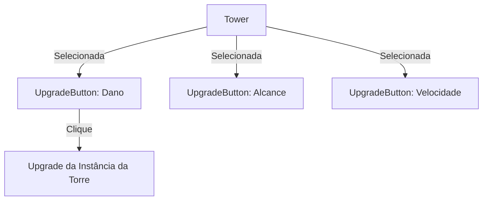

# Plano de Implementação: Sistema de Upgrades nas Torres e Redesenho Visual

Este plano detalha como adicionaremos um sistema de melhorias individuais em cada torre através de botões táteis flutuantes e como aprimoraremos a arte procedural da `TorreTaokey` para aproximar-se do visual cibernético/neon da imagem de referência.

---

## Proposta de Arquitetura de Upgrades

Cada torre terá três atributos melhoráveis de forma independente:
1. **Dano (Aumentar Dano)**: Ícone de Espada (Vermelho).
2. **Alcance (Aumentar Alcance)**: Ícone de Mira (Azul).
3. **Velocidade de Tiro (Aumentar Velocidade)**: Ícone de Projétil (Verde).

Para isso, adicionaremos componentes filhos na torre quando ela for selecionada.

### Mecânicas de Upgrade:
- **Custo Inicial**: $60 Pixcoins por upgrade.
- **Escalonamento**: A cada nível comprado, o custo daquele atributo específico aumenta em 50% (ex: 60 -> 90 -> 135 -> ...).
- **Atributos de Melhoria**:
  - Dano: $+4$ por nível.
  - Alcance: $+15.0$ pixels por nível.
  - Velocidade: Reduz o cooldown em 15% (multiplica `fireRate` por $0.85$, limitado ao mínimo de $0.15s$).

---

## Proposta de Mudanças no Código

### [Componentes de Upgrades e Torres]

#### [MODIFY] [tower.dart](file:///c:/Work/Mobile/td-game/lib/tower.dart)
1. **Atributos Dinâmicos**: Alterar `range`, `damage` e `fireRate` para não serem finais, permitindo que sejam alterados em tempo de execução.
2. **Níveis de Upgrades**:
   - `int damageLevel = 1;`
   - `int rangeLevel = 1;`
   - `int speedLevel = 1;`
   - `int damageUpgradeCost = 60;`
   - `int rangeUpgradeCost = 60;`
   - `int speedUpgradeCost = 60;`
3. **Gerenciamento de Botões**:
   - Quando `showRange` for ativado (clique na torre), instanciar e adicionar 3 `UpgradeButton` como componentes filhos da torre ou posicionados ao redor dela no jogo.
   - Quando `showRange` for desativado, remover os botões.
4. **Redesenho da Torre Taokey**:
   - Atualizar o método `render` para desenhar uma base hexagonal/metálica robusta (verde-escura e cinza) e um canhão cilíndrico metálico com um núcleo verde brilhante no centro, conforme o visual premium da imagem de referência.

#### [NEW] [upgrade_button.dart](file:///c:/Work/Mobile/td-game/lib/upgrade_button.dart)
Criar o componente de botão tátil para os upgrades.
- Extende `PositionComponent` com `TapCallbacks`.
- Atributos: `UpgradeType type`, `int cost`.
- Desenhar no Canvas:
  - Círculo translúcido com brilho neon nas cores correspondentes (Vermelho, Azul, Verde).
  - Ícone vetorial desenhado com linhas pretas/brancas (Espada, Mira, Projétil).
  - Exibição de custo texturizado abaixo do botão.

#### [MODIFY] [tower_slot.dart](file:///c:/Work/Mobile/td-game/lib/tower_slot.dart)
Ajustar a lógica de clique para que, ao desselecionar uma torre (ou selecionar outra), os botões da torre anterior sejam removidos corretamente do fluxo de renderização.

---

## Verificação e Testes

1. **Visual da Torre**:
   - Verificar se o canhão rotaciona em direção ao alvo e se o núcleo verde tem o gradiente de energia neon esperado.
2. **Exibição dos Botões**:
   - Ao clicar na torre instalada, os 3 botões devem surgir em semi-círculo acima dela (Vermelho à esquerda, Azul ao centro, Verde à direita).
   - O alcance (círculo azul translúcido) deve ser desenhado ao fundo.
   - Clicar fora ou em outro slot deve ocultar os botões.
3. **Funcionalidade e Custo**:
   - Clicar em um botão de upgrade com saldo suficiente deve:
     - Deduzir Pixcoins.
     - Incrementar o atributo correspondente (o círculo de alcance deve crescer imediatamente se o upgrade for de alcance!).
     - Escalar o preço mostrado abaixo do botão.
     - Mostrar um texto flutuante (ex: `+DANO!`).
   - Clicar sem dinheiro suficiente deve mostrar `Sem Pixcoins!`.
